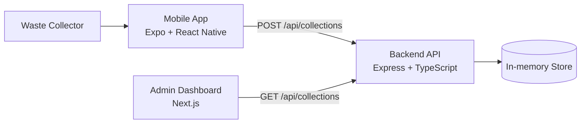

# Architecture

## System overview

The project is a monorepo composed of three runtime applications:

- `mobile` is a React Native + Expo client used by waste collectors to scan QR codes and submit collections.
- `backend` is an Express + TypeScript API that validates, stores, and protects collection submissions.
- `admin` is a Next.js dashboard used by operations staff to review and analyze collection activity.

## Architecture diagram

## Mobile-to-backend data flow

1. The collector opens the collection screen.
2. The app requests camera permission before showing the scanner.
3. Expo Camera detects a QR code and stops scanning immediately.
4. The collector enters the waste weight.
5. The app validates the weight on the client and submits a payload to the backend.
6. The backend validates the request again and stores the record if valid and unique.
7. The app handles success, duplicate, validation, and network failures with a retry path that preserves form state.

## Backend-to-admin data flow

1. The admin dashboard requests the collection list from the backend.
2. The Express service reads the in-memory collection array.
3. The backend returns records in newest-first order.
4. The dashboard renders summary cards and the table with filtering and formatting.

## API responsibilities

- Validate incoming request data independently of the mobile app.
- Enforce duplicate prevention using a safe unique QR ID check on the service layer.
- Calculate points as `weight * 15` on the backend.
- Return HTTP 201 for successful creation, 400 for validation errors, and 409 for duplicate submissions.
- Expose health and listing endpoints for monitoring and dashboard usage.

## Error-handling strategy

- Validation errors are returned as 400 with a consistent message.
- Duplicate errors are returned as 409 with a clear message.
- Unhandled errors go through centralized middleware.
- The mobile app treats network failures as non-fatal and keeps the data for retry.
- The backend uses request logging and structured error responses for easier diagnostics.

## Idempotency and duplicate prevention

The duplicate check is implemented at the service layer using a `Set` of processed QR IDs. This is safe for the current in-memory storage and is also structured so it can be replaced by a database transaction or uniqueness constraint later. A new record is only added after validating the QR ID and before returning success.

## Current storage limitations

- The current implementation uses an in-memory array.
- Data resets on backend restart.
- There is no multi-process synchronization or persistent database layer.
- Production deployments would require a database and proper transaction handling for concurrency.
