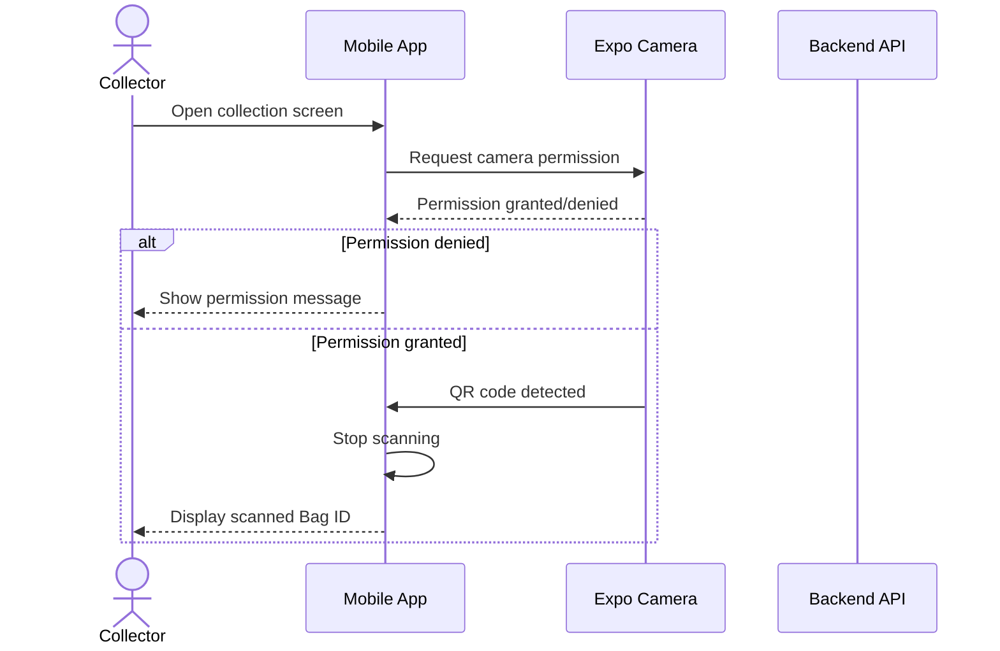
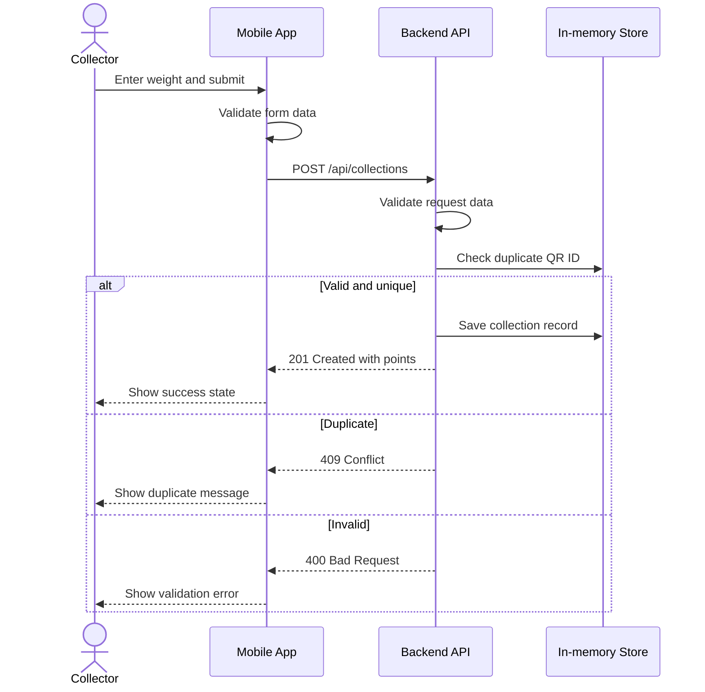
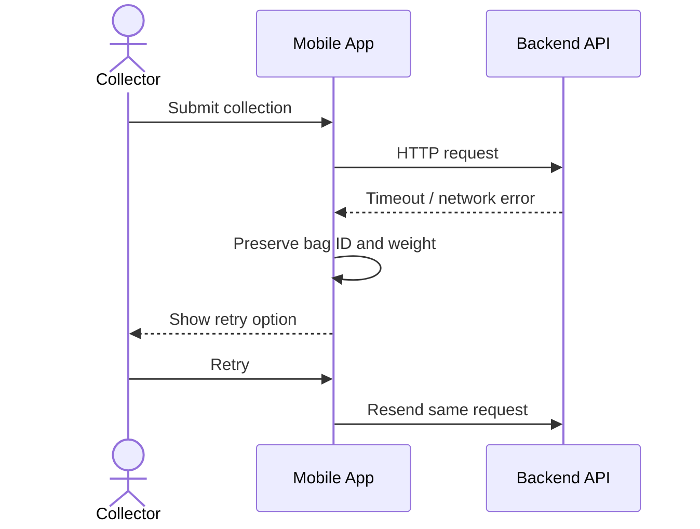
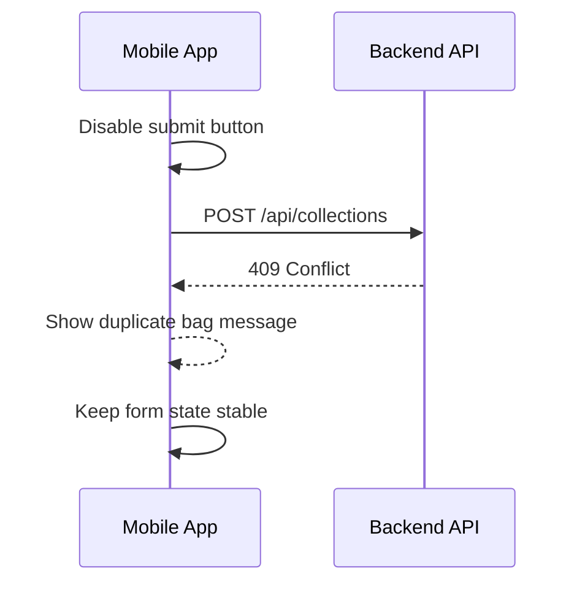
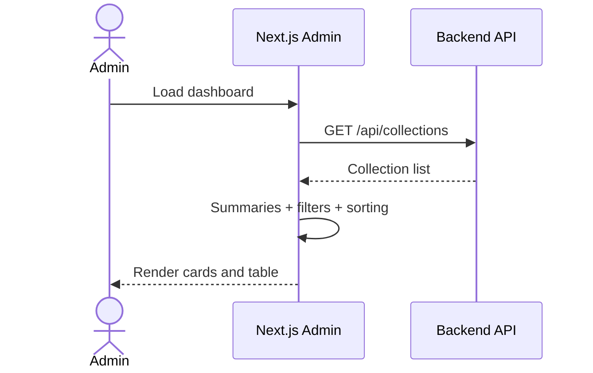

# System flow

## QR scanning flow

```mermaid
sequenceDiagram
  actor Collector
  participant Mobile as Mobile App
  participant Camera as Expo Camera
  participant Backend as Backend API

  Collector->>Mobile: Open collection screen
  Mobile->>Camera: Request camera permission
  Camera-->>Mobile: Permission granted/denied
  alt Permission denied
    Mobile-->>Collector: Show permission message
  else Permission granted
    Camera->>Mobile: QR code detected
    Mobile->>Mobile: Stop scanning
    Mobile-->>Collector: Display scanned Bag ID
  end
```

## Collection submission flow

```mermaid
sequenceDiagram
  actor Collector
  participant Mobile as Mobile App
  participant Backend as Backend API
  participant Store as In-memory Store

  Collector->>Mobile: Enter weight and submit
  Mobile->>Mobile: Validate form data
  Mobile->>Backend: POST /api/collections
  Backend->>Backend: Validate request data
  Backend->>Store: Check duplicate QR ID
  alt Valid and unique
    Backend->>Store: Save collection record
    Backend-->>Mobile: 201 Created with points
    Mobile-->>Collector: Show success state
  else Duplicate
    Backend-->>Mobile: 409 Conflict
    Mobile-->>Collector: Show duplicate message
  else Invalid
    Backend-->>Mobile: 400 Bad Request
    Mobile-->>Collector: Show validation error
  end
```

## Network failure and retry flow

```mermaid
sequenceDiagram
  actor Collector
  participant Mobile as Mobile App
  participant Backend as Backend API

  Collector->>Mobile: Submit collection
  Mobile->>Backend: HTTP request
  Backend-->>Mobile: Timeout / network error
  Mobile->>Mobile: Preserve bag ID and weight
  Mobile-->>Collector: Show retry option
  Collector->>Mobile: Retry
  Mobile->>Backend: Resend same request
```

## Duplicate submission flow

```mermaid
sequenceDiagram
  participant Mobile as Mobile App
  participant Backend as Backend API

  Mobile->>Mobile: Disable submit button
  Mobile->>Backend: POST /api/collections
  Backend-->>Mobile: 409 Conflict
  Mobile-->>Mobile: Show duplicate bag message
  Mobile->>Mobile: Keep form state stable
```

## Admin dashboard data-fetching flow

```mermaid
sequenceDiagram
  actor Admin
  participant Dashboard as Next.js Admin
  participant Backend as Backend API

  Admin->>Dashboard: Load dashboard
  Dashboard->>Backend: GET /api/collections
  Backend-->>Dashboard: Collection list
  Dashboard->>Dashboard: Summaries + filters + sorting
  Dashboard-->>Admin: Render cards and table
```
